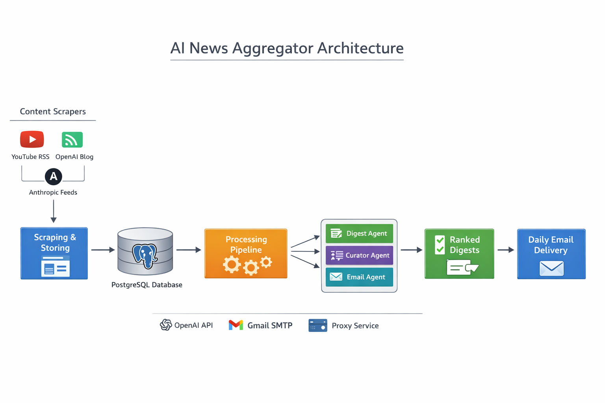

# 🏗️ System Architecture

## 🎯 Overview

The AI News Aggregator follows a **modular, pipeline-based architecture** designed for scalability and maintainability.

The system is divided into multiple independent components:
- 📥 Data ingestion (scrapers)
- 💾 Data storage (database)
- ⚙️ Processing pipeline
- 🤖 AI agents
- 📧 Delivery system (email)

---

## 🖼️ Architecture Diagram

<p align="center">
  
</p>

---

## 🔄 High-Level Architecture

```text
[Scrapers] 
   ↓
[Database (PostgreSQL)]
   ↓
[Processing Pipeline]
   ↓
[AI Agents]
   ↓
[Curated Results]
   ↓
[Email Delivery]
🧩 Components Breakdown
1. 📥 Scrapers (Data Ingestion Layer)

Responsible for collecting data from multiple sources:

YouTube (RSS + transcripts)
OpenAI blog (RSS feed)
Anthropic blog (RSS + HTML parsing)

Responsibilities:

Fetch latest content (last 24 hours)
Normalize data into structured format
Avoid duplicates before storing
2. 💾 Database Layer (PostgreSQL)

Stores all collected and processed data.

Main Tables:

youtube_videos
openai_articles
anthropic_articles
digests

Design Decisions:

Use SQLAlchemy ORM (no raw SQL)
Apply primary keys to prevent duplicates
Store intermediate states (e.g., transcript status)
3. ⚙️ Processing Pipeline

A 2-stage pipeline separates ingestion and enrichment:

Stage 1: Scrape & Store
Collect metadata from sources
Store raw data in DB
Stage 2: Enrichment
Fetch transcripts (YouTube)
Convert HTML → Markdown (Anthropic)
Prepare content for AI

Why this design?

Avoid re-scraping
Improve performance
Enable retries
4. 🤖 AI Agents Layer
🧠 Digest Agent
Input: article content / transcript
Output: summary (2–3 sentences) + category
🎯 Curator Agent
Input: all digests + user profile
Output: ranked top articles
📧 Email Agent
Input: ranked articles
Output: formatted HTML email
⚙️ Data Flow (Detailed)
1. Scrapers fetch latest content
2. Data stored in PostgreSQL
3. Processing pipeline enriches content
4. Digest Agent generates summaries
5. Curator Agent ranks articles
6. Email Agent sends daily digest
🔌 External Integrations
OpenAI API (LLM processing)
YouTube Transcript API
RSS feeds (YouTube, OpenAI, Anthropic)
Gmail SMTP (email delivery)
Proxy service (for scraping reliability)
🧱 Design Patterns Used
Repository Pattern (DB operations)
Base Class + Inheritance (agents & scrapers)
Pipeline Architecture (multi-stage processing)
Modular Design (easy to extend)
🚀 Scalability Considerations
Add new sources via scraper registry
Introduce task queues (e.g., Celery)
Cache API responses
Use managed database services (e.g., Render)
Add retry and logging mechanisms
⚠️ Key Challenges
Handling multiple data formats (RSS, HTML, transcripts)
Avoiding duplicate data
Managing API rate limits
Deployment constraints (memory, scraping limits)
🧠 Key Takeaway

This system is designed as a production-style AI pipeline, not just a script.

